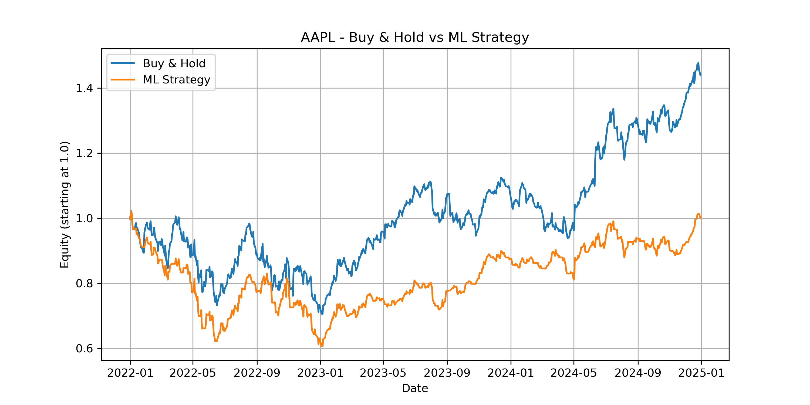

# Machine Learning in Finance Lab

This project is a personal research initiative where I explore how Machine Learning techniques can be applied to financial time series.  
The goal is not to build a production trading system, but to understand the challenges, limitations, and potential of predictive models in financial markets.

The project reflects what I have learned during my first months studying Python, quantitative finance, and data analysis.

---

## Objectives

- Study the behaviour of financial returns and basic market features  
- Build simple ML models to predict next-day price direction  
- Compare model-based decisions with a passive Buy & Hold benchmark  
- Understand overfitting, data leakage, and the importance of proper train/test splitting  
- Explore how feature engineering affects predictive power  

---

## Methodology

### **1. Data Collection**
- Historical daily prices downloaded from Yahoo Finance  
- Asset used in the baseline experiment: **AAPL (Apple Inc.)**  
- Time period: **2015–2024**

### **2. Feature Engineering**
The model uses simple, intuitive features built from price returns:
- Lagged returns  
- Rolling mean of returns  
- Rolling volatility  
- Short-term momentum indicators  

These features were selected to maintain interpretability and avoid overfitting, given the limited forecasting horizon.

### **3. Model**
A **Random Forest Classifier** is used to predict whether the next day’s return will be positive (1) or negative (0).

The dataset is split chronologically:
- 70% training  
- 30% testing  

No shuffling is used, to respect the time-series structure.

### **4. Strategy Logic**
The simple trading rule used for analysis:
- If the model predicts *up*: open a long position  
- If the model predicts *down*: stay in cash  
- No short-selling, no leverage, no transaction costs  

This makes the evaluation more transparent and easier to compare with Buy & Hold.

---

## Results

Below is an example of the equity curves generated by the project:

Final results (test period only):
- **Buy & Hold:** ~1.438  
- **ML Strategy:** ~1.014  

This highlights a key insight:
Even when a model performs well in classification metrics, turning predictions into profitable trading decisions remains challenging.  
This exercise helped me understand the gap between *predictive accuracy* and *economic profitability*.

---

## Key Learnings

- Markets are noisy: simple ML models often fail to outperform passive strategies  
- Feature choice has a huge impact on predictive power  
- Time-series split is crucial to avoid look-ahead bias  
- ML in finance requires more than prediction — it requires robust evaluation  
- Backtest simplicity makes interpretation easier and avoids unrealistic conclusions  

---

## Next Steps

I plan to expand the project by exploring:
- Gradient Boosting and XGBoost models  
- LSTM-based models for sequential data  
- Walk-forward validation  
- Feature selection and PCA  
- Multi-asset datasets  
- A more realistic backtesting engine
